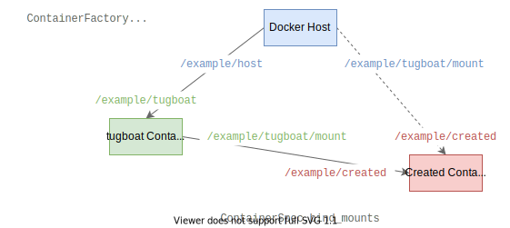

Usage
=====

Installation
------------

Using Poetry
^^^^^^^^^^^^

With the following in ``pyproject.toml``:

.. code-block:: toml

   [[tool.poetry.source]]
   name = "msw"
   url = "https://artifactory.metaswitch.com/api/pypi/pypi-virtual/simple/"
   default = true

Run::

   poetry add tugboat-docker

Using pip
^^^^^^^^^

Run::

   pip install --index-url https://artifactory.metaswitch.com/api/pypi/pypi-virtual/simple/ tugboat-docker

Choice of Event Loop
--------------------

``tugboat`` is tested with the three major event loop implementations:

- `asyncio <https://docs.python.org/3.6/library/asyncio.html>`_, part of the standard library;
- `trio <https://trio.readthedocs.io/en/stable/>`_, *"a friendly Python library for async concurrency and I/O"*;
- `curio <https://curio.readthedocs.io/en/latest/>`_, *"a coroutine-based library for concurrent Python systems programming"*.

Of these, **trio** is the recommended choice due to its superior error handling and reliability.

Internally ``tugboat`` uses `anyio <https://anyio.readthedocs.io/en/stable/index.html>`_, an abstraction over the event loop implementation.
Thus use of ``tugboat`` from code based on anyio is also supported.

Use of the library is the same regardless of the choice of event loop.

Specifying a Container
----------------------

All options for running a container are set on an instance of :class:`tugboat.ContainerSpec`.
The image reference must be supplied; the remaining options default to sensible values.

There are three supported ways to configure a container spec:

- Using the builder interface by chaining calls to the spec methods such as :any:`tugboat.ContainerSpec.set_args` or :any:`tugboat.ContainerSpec.add_bind_mount`;
- Supplying keyword arguments such as ``args`` or ``bind_mounts`` to the spec's ``__init__`` function;
- Directly modifying the spec's attributes such as :any:`tugboat.ContainerSpec.args` or :any:`tugboat.ContainerSpec.bind_mounts`.

.. include:: basic_usage.rst.inc

.. include:: one_shot_containers.rst.inc

.. include:: long_running_containers.rst.inc

Managing an existing Container
------------------------------

.. include:: manage_existing.rst.inc

Running in a Docker Container
-----------------------------

``tugboat`` may itself be run in a Docker container, provided the container includes a working Docker CLI.
Most function is unchanged, with the exception of bind mounts.

Since the host path of a bind mount is interpreted by the Docker daemon it must be a path on the Docker host's filesystem, not the filesystem of the container running ``tugboat``.
As a consequence only subdirectories of directories mounted by the Docker host into the ``tugboat`` container can be mounted by ``tugboat``.
For such directories ``tugboat`` can automatically deduce the correct path to pass to the Docker daemon given a mapping

   Docker host path -> ``tugboat`` container path

This path is supplied when constructing the :class:`tugboat.ContainerFactory`.

For programs using ``tugboat`` that may themselves be run in a Docker container, use of a :class:`tugboat.ContainerFactory` instance with an appropriate path mapping is recommended.
